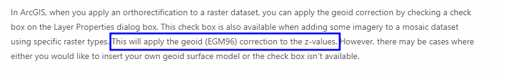
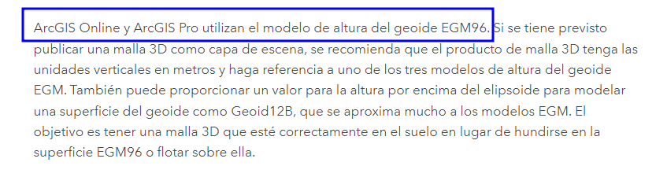
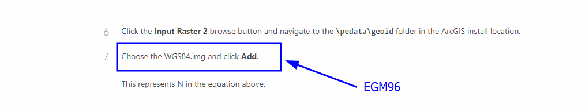

# Geoide models 🌍🗺️🛰️ 
In this repository, you can find different geoide models according to location.
This dataset is based on Agisoth Metashape.

Models                 | Country | Source
-----------------------|---------|------------------------------
EGM84 30' geoid model  | Global  | [download](https://s3-eu-west-1.amazonaws.com/download.agisoft.com/gtg/us_nga_egm84_30.tif) 
EGM96 15' geoid model  | Global  | [download](https://s3-eu-west-1.amazonaws.com/download.agisoft.com/gtg/us_nga_egm96_15.tif)
EGM2008 2.5' geoid model | Global  | [download](https://s3-eu-west-1.amazonaws.com/download.agisoft.com/gtg/us_nga_egm2008_25.tif)
EGM2008 1' geoid model | Global  | [download](https://s3-eu-west-1.amazonaws.com/download.agisoft.com/gtg/us_nga_egm2008_1.tif)
SRVN16 geoid model     | Argentina | [download](https://s3-eu-west-1.amazonaws.com/download.agisoft.com/gtg/ar_ign_GEOIDE-Ar16.tif)
AUSGeoid93 geoid model | Australia | [download](https://s3-eu-west-1.amazonaws.com/download.agisoft.com/gtg/au_ga_AUSGeoid93.tif)
AUSGeoid98 geoid model | Australia | [download](https://s3-eu-west-1.amazonaws.com/download.agisoft.com/gtg/au_ga_AUSGeoid98.tif)
AUSGeoid09 geoid model | Australia | [download](https://s3-eu-west-1.amazonaws.com/download.agisoft.com/gtg/au_ga_AUSGeoid09_V1.01.tif)
AUSGeoid20 geoid model | Australia | [download](https://s3-eu-west-1.amazonaws.com/download.agisoft.com/gtg/au_ga_AUSGeoid2020_20170908.tif)
CGVD2013 geoid model, NAD83(CSRS) version | Canada | [download](https://s3-eu-west-1.amazonaws.com/download.agisoft.com/gtg/ca_nrc_CGG2013n83.tif)
CGVD2013 geoid model, ITRF version | Canada | [download](https://s3-eu-west-1.amazonaws.com/download.agisoft.com/gtg/ca_nrc_CGG2013i08.tif)
CGVD28 geoid model | Canada | [download](https://s3-eu-west-1.amazonaws.com/download.agisoft.com/gtg/ca_nrc_HT2_0.tif)
CGG2010 geoid model| Canada | [download](https://s3-eu-west-1.amazonaws.com/download.agisoft.com/gtg/ca_nrc_CGG2010n83.tif)
CGG2005 geoid model | Canada | [download](https://s3-eu-west-1.amazonaws.com/download.agisoft.com/gtg/ca_nrc_CGG2005n83.tif)
CGG2000 geoid model | Canada | [download](https://s3-eu-west-1.amazonaws.com/download.agisoft.com/gtg/ca_nrc_CGG2000n83.tif)
GSD95 geoid model| Canada | [download](https://s3-eu-west-1.amazonaws.com/download.agisoft.com/gtg/ca_nrc_NGSD95n83.tif)
GSD91 geoid model | Canada | [download](https://s3-eu-west-1.amazonaws.com/download.agisoft.com/gtg/ca_nrc_NGSD91n83.tif)
DVR90 geoid model | Denmark | [download](https://s3-eu-west-1.amazonaws.com/download.agisoft.com/gtg/dk_sdfe_dvr90.tif)
N2000 geoid model |Finland |[download](https://s3-eu-west-1.amazonaws.com/download.agisoft.com/gtg/fi_nls_FIN2005N00.tif)
N60 geoid model |Finland | [download](https://s3-eu-west-1.amazonaws.com/download.agisoft.com/gtg/fi_nls_FIN2000.tif)
RAF09 geoid model |France | [download](https://s3-eu-west-1.amazonaws.com/download.agisoft.com/gtg/fr_ign_RAF09.tif)
RAF20 geoid model |France | [download](https://s3-eu-west-1.amazonaws.com/download.agisoft.com/gtg/fr_ign_RAF20.tif)
RAC09 geoid model |France | [download](https://s3-eu-west-1.amazonaws.com/download.agisoft.com/gtg/fr_ign_RAC09.tif)
RAC23 geoid model |France | [download](https://s3-eu-west-1.amazonaws.com/download.agisoft.com/gtg/fr_ign_RAC23.tif)
GCG2011 geoid model |Germany | [download](https://s3-eu-west-1.amazonaws.com/download.agisoft.com/gtg/de_bkg_GCG2011.tif)
GCG2016 geoid model |Germany | [download](https://s3-eu-west-1.amazonaws.com/download.agisoft.com/gtg/de_bkg_GCG2016.tif)
GCG2016/2023 geoid model |Germany | [download](https://s3-eu-west-1.amazonaws.com/download.agisoft.com/gtg/de_bkg_GCG2016v2023.tif)
GSIGEO2011 geoid model| Japan | [download](https://s3-eu-west-1.amazonaws.com/download.agisoft.com/gtg/jp_gsi_gsigeo2011.tif)
GGM2010 geoid model | Mexico |  [download](https://s3-eu-west-1.amazonaws.com/download.agisoft.com/gtg/mx_inegi_GGM10.tif)
NLGEO2004 geoid model |Netherlands| [download](https://s3-eu-west-1.amazonaws.com/download.agisoft.com/gtg/nl_nsgi_NLGEO2004.tif)
NLGEO2018 geoid model |Netherlands| [download](https://s3-eu-west-1.amazonaws.com/download.agisoft.com/gtg/nl_nsgi_NLGEO2018.tif)
NZVD2009 geoid model |New Zealand|[download](https://s3-eu-west-1.amazonaws.com/download.agisoft.com/gtg/nz_linz_nzgeoid2009.tif)
NZVD2016 geoid model |New Zealand|[download](https://s3-eu-west-1.amazonaws.com/download.agisoft.com/gtg/nz_linz_nzgeoid2016.tif)
NN 54 geoid model | Norway | [download](https://s3-eu-west-1.amazonaws.com/download.agisoft.com/gtg/no_kv_href2008a.tif)
NN 2000 (2018A) geoid model |Norway | [download](https://s3-eu-west-1.amazonaws.com/download.agisoft.com/gtg/no_kv_HREF2018A_NN2000_EUREF89.tif)
NN 2000 (2018B) geoid model |Norway | [download](https://s3-eu-west-1.amazonaws.com/download.agisoft.com/gtg/no_kv_HREF2018B_NN2000_EUREF89.tif)
PNG08 geoid model| Papua New Guinea| [download](https://s3-eu-west-1.amazonaws.com/download.agisoft.com/gtg/pg_aspng_PNG08.tif)
GeodPT08 geoid model | Portugal | [download](https://s3-eu-west-1.amazonaws.com/download.agisoft.com/gtg/pt_dgt_GeodPT08.tif)
SLO_AMG2000 geoid model| Slovenia |[download](https://s3-eu-west-1.amazonaws.com/download.agisoft.com/gtg/si_gu_SLO_AMG2000E.tif)
SLO_VRP2016 geoid model| Slovenia |[download](https://s3-eu-west-1.amazonaws.com/download.agisoft.com/gtg/si_gu_SLOVRP2016.tif)
SAGEOID10 geoid model| South Africa | [download](https://s3-eu-west-1.amazonaws.com/download.agisoft.com/gtg/za_ngi_SAGEOID10.tif)
EGM08-REDNAP geoid model|Spain|[download](https://s3-eu-west-1.amazonaws.com/download.agisoft.com/gtg/es_ign_EGM08_REDNAP.tif)
EGM08-REDNAP Canarias geoid model|Spain|[download](https://s3-eu-west-1.amazonaws.com/download.agisoft.com/gtg/es_ign_EGM08_REDNAP_Canarias.tif)
SWEN08_RH70 geoid model|Sweden|[download](https://s3-eu-west-1.amazonaws.com/download.agisoft.com/gtg/se_lantmateriet_SWEN08_RH70.tif)
SWEN08_RH2000 geoid model|Sweden|[download](https://s3-eu-west-1.amazonaws.com/download.agisoft.com/gtg/se_lantmateriet_SWEN08_RH2000.tif)
SWEN17_RH70 geoid model|Sweden|[download](https://s3-eu-west-1.amazonaws.com/download.agisoft.com/gtg/se_lantmateriet_SWEN17_RH70.tif)
SWEN17_RH2000 geoid model|Sweden|[download](https://s3-eu-west-1.amazonaws.com/download.agisoft.com/gtg/se_lantmateriet_SWEN17_RH2000.tif)
CHGeo2004 geoid model|Switzerland|[download](https://s3-eu-west-1.amazonaws.com/download.agisoft.com/gtg/ch_swisstopo_chgeo2004_ETRS89_LHN95.tif)
CHGeo2004 geoid model |Switzerland|[download](https://s3-eu-west-1.amazonaws.com/download.agisoft.com/gtg/ch_swisstopo_chgeo2004_ETRS89_LN02.tif)
OSGM02 geoid model (EPSG::5101)| United Kingdom|[download](https://s3-eu-west-1.amazonaws.com/download.agisoft.com/geoids/osgb36_osgm02.tif)
OSGM15 geoid model (EPSG::5101)| United Kingdom|[download](https://s3-eu-west-1.amazonaws.com/download.agisoft.com/geoids/osgb36_osgm15.tif)
Geoid 99|United States|[download](https://s3-eu-west-1.amazonaws.com/download.agisoft.com/gtg/us_noaa_g1999.tif)
Geoid 03|United States|[download](https://s3-eu-west-1.amazonaws.com/download.agisoft.com/gtg/us_noaa_g2003.tif)
Geoid 06|United States|[download](https://s3-eu-west-1.amazonaws.com/download.agisoft.com/gtg/us_noaa_g2006a01.tif)
Geoid 09, Conterminous United States|United States|[download](https://s3-eu-west-1.amazonaws.com/download.agisoft.com/gtg/us_noaa_g2009.tif)
Geoid 09, Guam and Northern Mariana Islands|United States|[download](https://s3-eu-west-1.amazonaws.com/download.agisoft.com/gtg/us_noaa_g2009g01.tif)
Geoid 09, Puerto Rico and U.S. Virgin Islands|United States|[download](https://s3-eu-west-1.amazonaws.com/download.agisoft.com/gtg/us_noaa_g2009p01.tif)
Geoid 09, American Samoa|United States|[download](https://s3-eu-west-1.amazonaws.com/download.agisoft.com/gtg/us_noaa_g2009s01.tif)
Geoid 12A, Conterminous United States|United States|[download](https://s3-eu-west-1.amazonaws.com/download.agisoft.com/gtg/us_noaa_g2012a.tif)
Geoid 12A, Guam and Northern Mariana Islands|United States|[download](https://s3-eu-west-1.amazonaws.com/download.agisoft.com/gtg/us_noaa_g2012ag0.tif)
Geoid 12A, Hawaii|United States|[download](https://s3-eu-west-1.amazonaws.com/download.agisoft.com/gtg/us_noaa_g2012ah0.tif)
Geoid 12A, Puerto Rico and U.S. Virgin Islands|United States|[download](https://s3-eu-west-1.amazonaws.com/download.agisoft.com/gtg/us_noaa_g2012ap0.tif)
Geoid 12A, American Samoa|United States|[download](https://s3-eu-west-1.amazonaws.com/download.agisoft.com/gtg/us_noaa_g2012as0.tif)
Geoid 12B, Conterminous United States|United States|[download](https://s3-eu-west-1.amazonaws.com/download.agisoft.com/gtg/us_noaa_g2012b.tif)
Geoid 12B, Guam and Northern Mariana Islands|United States|[download](https://s3-eu-west-1.amazonaws.com/download.agisoft.com/gtg/us_noaa_g2012bg0.tif)
Geoid 12B, Hawaii|United States|[download](https://s3-eu-west-1.amazonaws.com/download.agisoft.com/gtg/us_noaa_g2012bh0.tif)
Geoid 12B, Puerto Rico and U.S. Virgin Islands|United States|[download](https://s3-eu-west-1.amazonaws.com/download.agisoft.com/gtg/us_noaa_g2012bp0.tif)
Geoid 12B, American Samoa|United States|[download](https://s3-eu-west-1.amazonaws.com/download.agisoft.com/gtg/us_noaa_g2012bs0.tif)
Geoid 18, Conterminous United States|United States|[download](https://s3-eu-west-1.amazonaws.com/download.agisoft.com/gtg/us_noaa_g2018u0.tif)
Geoid 18, Puerto Rico and U.S. Virgin Islands|United States|[download](https://s3-eu-west-1.amazonaws.com/download.agisoft.com/gtg/us_noaa_g2018p0.tif)

# **Applications**
## ArcGIS uses with backend the Geoide EGM96 Model  

## References
 - https://www.agisoft.com/downloads/geoids/
 - https://desktop.arcgis.com/en/arcmap/latest/manage-data/raster-and-images/wkflw-converting-from-orthometric-to-ellipsoidal-heights
 - https://doc.arcgis.com/es/drone2map/2.3/help/vertical-reference.htm
 - https://community.esri.com/t5/coordinate-reference-systems-blog/bg-p/coordinate-reference-systemsblog-board/label-name/vertical%20coordinate%20system
 - https://www.degruyter.com/document/doi/10.1515/jag-2019-0030/html?lang=de
  